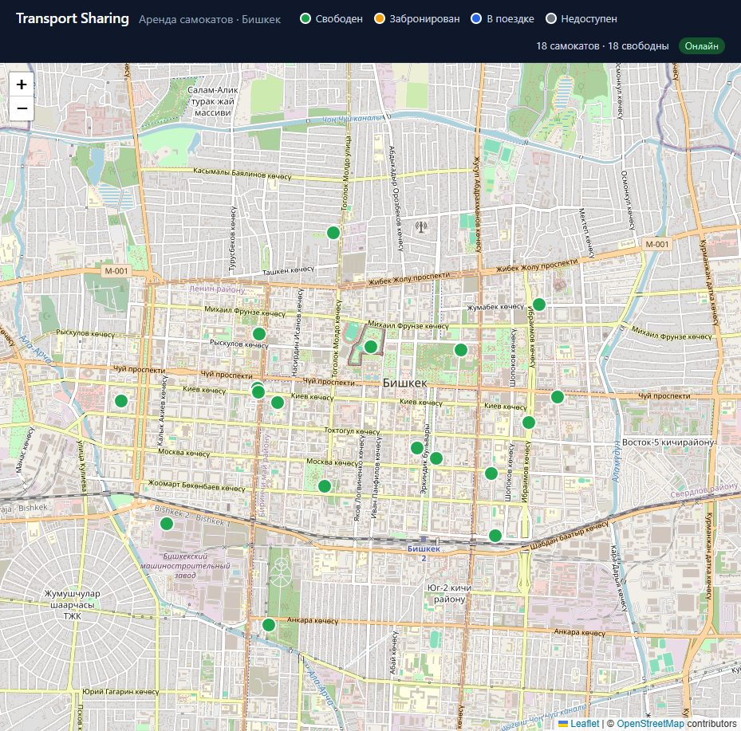
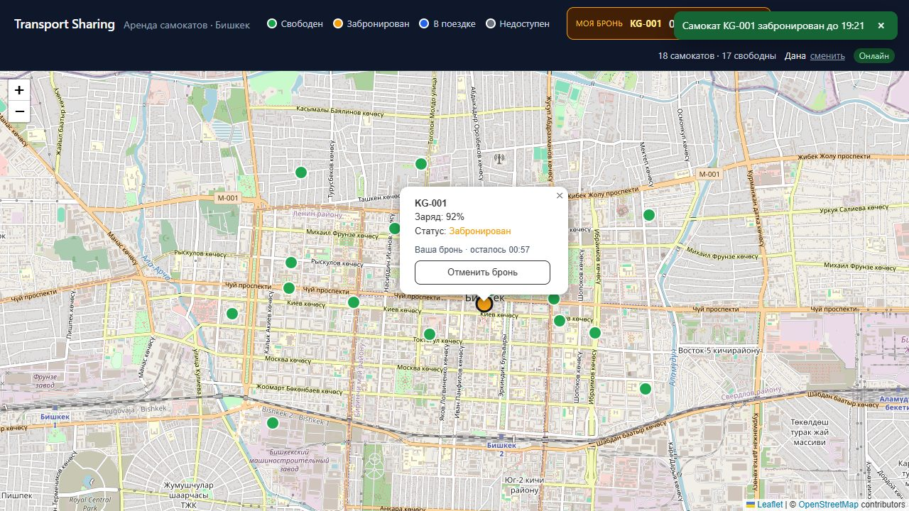
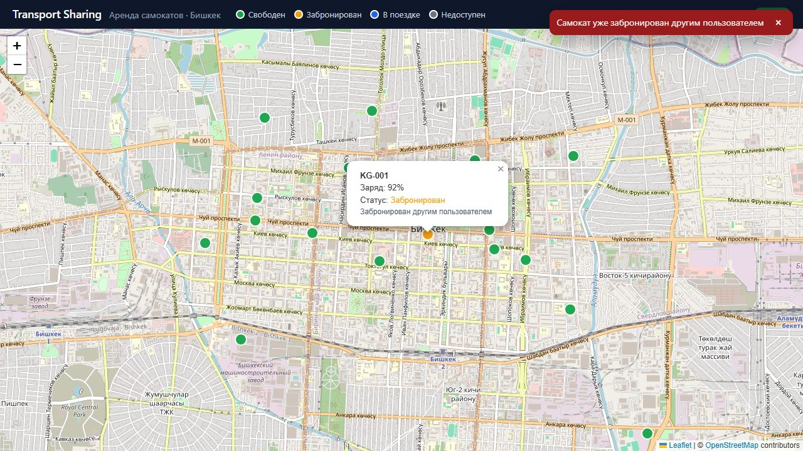
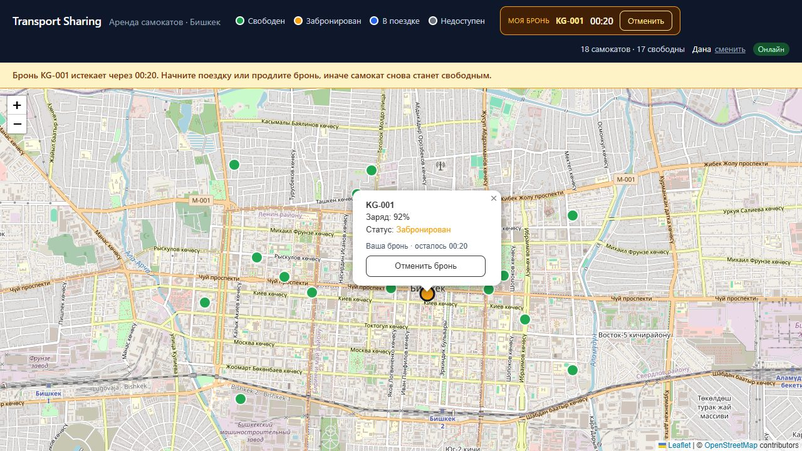
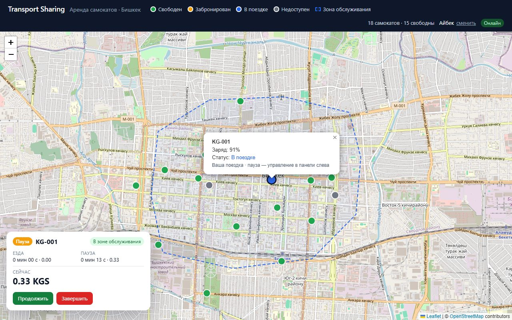
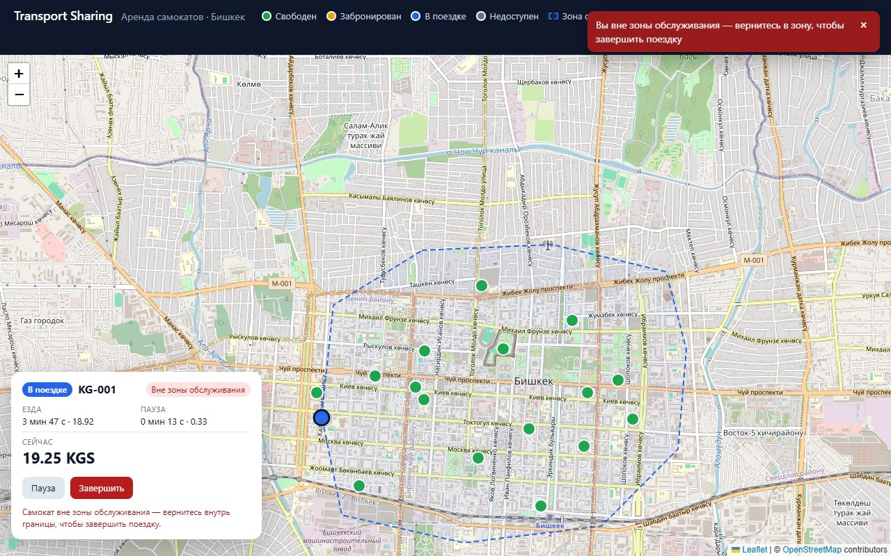
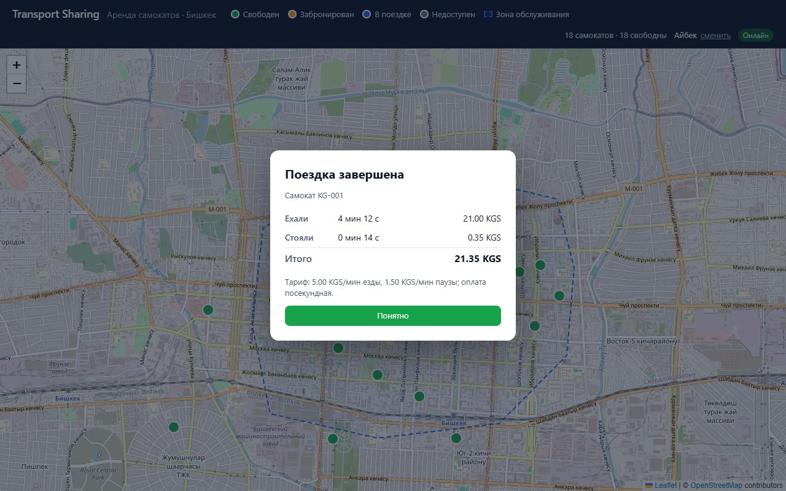

# Transport Sharing

Сервис шеринга самокатов — тестовое задание на вакансию Agentic Developer.

Клиент-серверное приложение: отдельный бэкенд (REST API + WebSocket), отдельный фронтенд (SPA
с картой), реляционная база и симулятор телеметрии. Пользователи бронируют самокаты на 15 минут,
бронь видна всем в реальном времени, снимается автоматически и защищена от гонок на уровне базы.
Из брони начинается поездка с посекундной тарификацией (езда и пауза по разным тарифам, деньги
только `Decimal`), завершить её можно только внутри зоны обслуживания; по завершении — чек с разбивкой.
Всё поднимается одной командой через Docker Compose.

## Стек

| Слой | Технологии |
| --- | --- |
| Backend | Python 3.12, FastAPI, SQLAlchemy 2 (async, asyncpg), Alembic, pydantic-settings; uv, ruff, pytest |
| Frontend | React 19, Vite, TypeScript, react-leaflet + OpenStreetMap; oxlint, vitest |
| Simulator | Python 3.12, httpx; uv, ruff, pytest |
| База | PostgreSQL 16 |
| Инфраструктура | Docker Compose, nginx (раздача фронтенда и прокси `/api`, включая WebSocket), GitHub Actions |

## Быстрый старт (Docker)

Нужен Docker с Compose v2.

```bash
cp .env.example .env        # необязательно: у всех переменных есть значения по умолчанию
docker compose up --build
```

Поднимаются четыре сервиса: `db`, `backend` (применяет миграции и сидит 18 самокатов), `frontend`
и `simulator`, который двигает самокаты по Бишкеку и шлёт телеметрию. Через несколько секунд после
старта на карте появляются маркеры, и часть из них едет.

| Что | Адрес |
| --- | --- |
| Карта (фронтенд) | http://localhost:3000 |
| Список самокатов | http://localhost:3000/api/scooters (и http://localhost:8000/api/scooters напрямую) |
| WebSocket с обновлениями | `ws://localhost:3000/api/ws` |
| Health / readiness бэкенда | http://localhost:8000/api/health → `{"status":"ok"}`, http://localhost:8000/api/health/db |
| Swagger UI | http://localhost:8000/api/docs |
| PostgreSQL | `localhost:5432` (или `POSTGRES_PORT` из `.env`), пользователь/пароль/база — `scooter` |

Остановить: `docker compose down` (вместе с данными базы — `docker compose down -v`).

### Как это выглядит

| Карта с парком самокатов | Своя бронь: отсчёт в шапке и в попапе |
| --- | --- |
|  |  |

| Второй пользователь нажал «Забронировать» тот же самокат | Баннер и тост перед снятием брони |
| --- | --- |
|  |  |

| Поездка на паузе: панель с таймерами и текущей стоимостью | Завершить снаружи нельзя: бейдж, тост и подсказка |
| --- | --- |
|  |  |

| Чек после завершения внутри зоны |
| --- |
|  |

Кадры брони сняты в сквозной проверке с укороченными интервалами (`BOOKING_TTL_SECONDS=60`,
`BOOKING_WARN_BEFORE_SECONDS=20`), поэтому на них минутный отсчёт. Пунктирная граница на карте —
зона обслуживания.

### Что проверить на карте

- Маркеры окрашены по статусу (легенда в шапке): свободен, забронирован, в поездке, недоступен.
  В попапе — код, заряд и статус.
- Откройте две вкладки: обе получают одни и те же обновления по WebSocket, маркеры двигаются
  синхронно, без перезагрузки страницы. Индикатор в шапке показывает состояние соединения.
- Самокат с зарядом ниже `LOW_BATTERY_THRESHOLD` (15 %) становится недоступным и показывается серым.
  В сиде таких два (`KG-006`, `KG-012`); симулятор «заряжает» недоступные самокаты через
  `SIM_RECHARGE_SECONDS` (3 минуты), а у едущих заряд падает, так что серые маркеры появляются и
  позже. Правило можно вызвать вручную:

```bash
curl -X POST http://localhost:8000/api/telemetry -H "Content-Type: application/json" \
  -d '{"code": "KG-001", "lat": 42.8756, "lon": 74.6036, "battery": 5}'
```

### Бронирование

- При первом заходе интерфейс спрашивает имя — паролей нет, пользователь живёт в `sessionStorage`
  вкладки, поэтому **вторая вкладка = второй пользователь** (инкогнито не нужен).
- В попапе свободного самоката — «Забронировать на 15 мин». У своей брони в шапке и в попапе —
  обратный отсчёт и «Отменить»; у всех остальных самокат становится жёлтым.
- Нажмите «Забронировать» на одном и том же самокате в двух вкладках: бронь получит один, второй
  увидит «Самокат уже забронирован другим пользователем». Одновременно у пользователя только одна
  активная бронь.
- Без действий бронь снимается сама по истечении времени, за 3 минуты до этого приходит
  предупреждение (тост и баннер). Таймеры живут в базе: после `docker compose restart backend`
  активные брони и их сроки продолжают действовать.
- Чтобы не ждать 15 минут, задайте в `.env` короткие интервалы, например
  `BOOKING_TTL_SECONDS=60`, `BOOKING_WARN_BEFORE_SECONDS=20`, `BOOKING_SWEEP_INTERVAL_SECONDS=1`,
  и перезапустите `docker compose up -d backend`.

### Поездка

- У своей брони — «Начать поездку» (в шапке и в попапе). Самокат становится синим у всех и едет: в
  демо им управляет симулятор. Слева внизу — панель поездки: время и стоимость езды и паузы,
  текущая сумма, бейдж «В зоне / Вне зоны обслуживания», кнопки «Пауза» / «Продолжить» / «Завершить».
- «Пауза»: самокат останавливается, счёт продолжает расти по тарифу паузы (1.50 сом/мин против
  5.00 сом/мин езды). У других в попапе — «В поездке · пауза».
- Симулятор ведёт поездку пользователя попеременно к краю зоны катания (снаружи зоны обслуживания)
  и обратно в её центр: примерно через 2 минуты после старта самокат выезжает из зоны, остаётся
  снаружи около минуты, потом около 2.5 минут внутри. «Завершить» снаружи даёт тост «Вы вне зоны
  обслуживания — вернитесь в зону, чтобы завершить поездку», поездка продолжается.
- «Завершить» внутри — чек: сколько ехали, сколько стояли, сколько вышло; сумма строк равна
  итогу до копейки. Самокат снова свободен у всех.
- Не хочется ждать возвращения в зону: остановите симулятор (иначе через 3 секунды он вернёт
  самокат на своё место), отправьте от имени самоката телеметрию с координатами внутри зоны,
  нажмите «Завершить» и снова запустите симулятор:

```bash
docker compose stop simulator
curl -X POST http://localhost:8000/api/telemetry -H "Content-Type: application/json" \
  -d '{"code": "KG-001", "lat": 42.8756, "lon": 74.6036, "battery": 60}'
docker compose start simulator
```

## API

| Метод и путь | Назначение |
| --- | --- |
| `GET /api/health` | liveness, без обращения к базе |
| `GET /api/health/db` | readiness: `SELECT 1`, при недоступной базе — 503 |
| `GET /api/scooters` | все самокаты: `code`, `lat`, `lon`, `battery`, `status`, `paused`, `updated_at` |
| `POST /api/telemetry` | `{code, lat, lon, battery}` от самоката; отвечает актуальным состоянием, 404 для неизвестного кода |
| `GET /api/config` | публичные настройки для интерфейса: длительность брони, порог предупреждения, порог заряда, тарифы и валюта |
| `POST /api/users` | регистрация по имени → `{id, name, created_at}`; дальше клиент шлёт `X-User-Id` |
| `GET /api/users/me` | проверка сохранённого id (401 — зарегистрироваться заново) |
| `POST /api/bookings` | `{scooter_code}` → 201 бронь на `BOOKING_TTL_SECONDS`; 409 `scooter_not_available` / `user_has_active_booking` |
| `GET /api/bookings/active` | активная бронь пользователя или `null` |
| `POST /api/bookings/{id}/cancel` | отмена своей брони (403 чужая, 409 уже завершена) |
| `POST /api/rides` | `{booking_id}` → 201 поездка из своей активной брони (бронь → `used`, самокат → `riding`); повторный старт той же брони — 200 с той же поездкой; 403 чужая бронь, 409 `booking_not_active` / `user_has_active_ride` / `scooter_not_available` / `scooter_battery_low` |
| `GET /api/rides/active` | текущая поездка пользователя (активная или на паузе) или `null` |
| `POST /api/rides/{id}/pause` | пауза (сегмент езды закрывается со стоимостью, открывается сегмент паузы); повтор — 200 без изменений |
| `POST /api/rides/{id}/resume` | возобновление; повтор — 200 без изменений |
| `POST /api/rides/{id}/finish` | завершение: 409 `outside_service_zone`, если самокат вне зоны; иначе 200 с `receipt`; повтор — 200 с тем же чеком; 409 `ride_finished` для паузы/возобновления завершённой |
| `GET /api/zones` | зоны обслуживания: `[{id, name, points: [{lat, lon}, …]}]` |
| `WS /api/ws` | всем: `scooter.updated`; после `{"type": "identify", "user_id": N}` лично: `booking.created`, `booking.cancelled`, `booking.expiring` (с `seconds_left`), `booking.expired`, `ride.started`, `ride.paused`, `ride.resumed`, `ride.finished` |

Правило заряда: если `battery` строго ниже порога, самокат получает статус `unavailable`; когда
телеметрия приносит заряд не ниже порога, недоступный самокат снова становится `available`.
Статусы `reserved` и `riding` телеметрия не меняет: пока самокат удерживает пользователь, заряд только
записывается. Правило порога применяется в момент освобождения (отмена или снятие брони, завершение
поездки: самокат становится `unavailable`, если разрядился) и при старте поездки (с разряженного
самоката поездку начать нельзя — 409 `scooter_battery_low`, бронь можно отменить).

Ошибки приходят как `{"detail": {"code": "...", "message": "..."}}`; интерфейс показывает текст по коду.

### Как устроена бронь

- Создание брони — одна транзакция: `SELECT … FOR UPDATE` строки пользователя, затем строки
  самоката. Второй одновременный запрос ждёт на блокировке, после коммита первого видит `reserved`
  и получает 409. Страховка — частичные уникальные индексы `bookings(scooter_id) WHERE status =
  'active'` и `bookings(user_id) WHERE status = 'active'`.
- Таймеры хранятся в базе (`expires_at`). Фоновая задача раз в `BOOKING_SWEEP_INTERVAL_SECONDS`
  снимает просроченные брони и возвращает самокаты, а за `BOOKING_WARN_BEFORE_SECONDS` до снятия
  отправляет пользователю уведомление ровно один раз (`warned_at` выставляется атомарным `UPDATE`).
  Перезапуск бэкенда ничего не теряет: первая итерация после старта доделывает пропущенное.
- Предупреждение приходит, когда до снятия осталось меньше `min(BOOKING_WARN_BEFORE_SECONDS,
  длина брони / 2)`: обычная 15-минутная бронь — за 3 минуты, короткая демо-бронь на 60 секунд —
  за 30 секунд, а не в момент создания.

### Точность таймеров

- Снятие и предупреждение делает фоновая задача с периодом `BOOKING_SWEEP_INTERVAL_SECONDS`
  (по умолчанию 2 с; задаётся в `.env`, пробрасывается в compose). Оба события опаздывают не
  больше чем на один период плюс время запроса к базе; при периоде 1 с бронь снимается через
  секунду после `expires_at`.
- Пока бэкенд не работает, ничего не снимается; после старта первая итерация снимает всё
  просроченное и досылает предупреждения, которые не успели уйти (`warned_at` пустой).
- Обратный отсчёт в интерфейсе считается по часам клиента от серверного `expires_at`;
  расхождение часов не компенсируется. Баннер появляется по клиентским часам, тост — по событию
  с сервера, поэтому они могут разойтись на период фоновой задачи.

### Как устроена поездка и тарификация

- Поездка (`rides`) состоит из сегментов (`ride_segments`) двух видов: езда и пауза. «Пауза»
  закрывает сегмент езды и открывает сегмент паузы, «Продолжить» — наоборот, «Завершить» закрывает
  открытый сегмент и выставляет чек. Тарифы фиксируются в поездке при старте: изменение настроек не
  меняет счёт уже идущей поездки.
- **Правило округления.** Оплата посекундная: `стоимость сегмента = тариф_в_минуту × секунды / 60`,
  округление до копейки половиной вверх — для каждого сегмента отдельно. Секунды сегмента — разность
  целых секунд, прошедших с начала поездки, поэтому дробные остатки переходят в следующий сегмент,
  а не теряются: сегменты в сумме дают `floor(длительность поездки)`, и частое переключение
  пауза/возобновление не обнуляет счёт. Стоимость езды — сумма сегментов езды, паузы — сумма
  сегментов паузы, итог — их
  сумма, поэтому разбивка всегда сходится с итогом (это закреплено и `CHECK` в базе, и тестами:
  границы минут, многократные паузы, свойство «копейки не теряются» на случайных наборах).
  Деньги — `Decimal` в коде, `NUMERIC(10,2)` в базе, строки вида `"7.50"` в JSON.
- Панель на клиенте считает текущую стоимость тем же правилом в целых копейках (закрытые сегменты —
  из стоимости, посчитанной сервером, открытый — по клиентским часам); источник истины при
  завершении — чек сервера. Одни и те же тестовые векторы лежат в pytest и vitest.
- Идемпотентность: повторный старт по той же брони, повторные пауза/возобновление и повторное
  завершение возвращают текущее состояние (200) и ничего не меняют; одновременные старты по одной
  брони создают одну поездку. Одна незавершённая поездка на пользователя и на самокат — частичные
  уникальные индексы плюс блокировки строк.
- **Зона обслуживания** хранится в таблице `service_zones` (многоугольник `{lat, lon}`), сидится вместе
  с самокатами и отдаётся через `GET /api/zones`. Завершить поездку можно только внутри хотя бы
  одной зоны; проверяется положение самоката по последней телеметрии, координаты в запросе не
  передаются. Точка-в-полигоне — лучевой алгоритм на чистом Python (и его копия на TypeScript для
  бейджа «в зоне / вне зоны»), без PostGIS: обоснование в DEVLOG. Пустой список зон означает
  «завершить нельзя», бэкенд пишет предупреждение в лог.

## Режим разработки (hot reload)

Стек из «Быстрого старта» собирает фронтенд в статику, поэтому каждое изменение кода требует
пересборки образа. Для разработки есть overlay `docker-compose.dev.yml`:

```bash
docker compose -f docker-compose.yml -f docker-compose.dev.yml up --build
```

| Что | Как работает в dev-режиме |
| --- | --- |
| Фронтенд | Vite dev server на http://localhost:5173 с HMR; каталог `frontend/` примонтирован в контейнер, `/api` и WebSocket проксируются на бэкенд |
| Бэкенд | `uvicorn --reload` на http://localhost:8000; примонтированы `backend/app` и `backend/alembic` |
| База и симулятор | те же, что в обычном режиме |

После изменения зависимостей (`package.json`, `pyproject.toml`) пересоберите образы: запустите ту же
команду с `--build -V` (`-V` обновляет `node_modules` внутри контейнера фронтенда).

Порт dev-сервера фиксирован (5173): HMR-клиент Vite подключается к порту страницы. Работать без Docker
можно так же удобно — см. раздел «Локальная разработка без Docker».

## Локальная разработка без Docker

### Backend

Нужен [uv](https://docs.astral.sh/uv/) — он сам поставит Python 3.12 из `backend/.python-version`.
Для интеграционных тестов и запуска нужна база: `docker compose up -d db`.

```bash
cd backend
uv sync                                  # .venv + зависимости (включая dev)
uv run alembic upgrade head              # миграции
uv run python -m app.seed                # демо-парк (только в пустую таблицу)
uv run uvicorn app.main:app --reload     # http://localhost:8000/api/health
uv run pytest                            # все тесты, включая интеграционные с базой
uv run pytest -m "not db"                # только быстрые тесты без базы
uv run ruff check . && uv run ruff format --check .
```

Настройки читаются из переменных окружения либо из `.env` в корне репозитория и/или в `backend/`
(см. `app/core/config.py`). Интеграционные тесты сами создают базу `<POSTGRES_DB>_test`, прогоняют
в ней миграции и удаляют её после прогона; каждый тест выполняется в транзакции с откатом.
Тесты гонок (одновременные брони, ожидание на блокировке строки) используют фикстуру
`committed_db` с настоящими коммитами и очисткой таблиц после теста.

Если порт 5432 на хосте занят (например, локально установленным PostgreSQL), задайте в `.env`
другой `POSTGRES_PORT` (скажем, `15432`): compose опубликует базу на нём, а бэкенд и тесты подхватят
значение из того же `.env`.

### Frontend

Нужен Node.js 22+.

```bash
cd frontend
npm install
npm run dev      # http://localhost:5173, /api и WebSocket проксируются на localhost:8000
npm run lint     # oxlint
npm test         # vitest
npm run build    # tsc + vite build → dist/
```

Адрес бэкенда для dev-прокси можно переопределить переменной `VITE_API_PROXY_TARGET`.

### Simulator

```bash
cd simulator
uv sync
uv run pytest
uv run ruff check . && uv run ruff format --check .
BACKEND_URL=http://localhost:8000 uv run python -m scootersim
```

## Симулятор

Отдельный сервис `simulator` (пакет `scootersim`): берёт список самокатов у бэкенда, часть из них
отправляет в поездки к случайным точкам центра Бишкека, у едущих падает заряд, и раз в
`SIM_INTERVAL_SECONDS` шлёт телеметрию по HTTP. Самокат, который бэкенд пометил недоступным,
«заряжает техник» через `SIM_RECHARGE_SECONDS`. Недоступность бэкенда симулятор переживает: пишет
предупреждение, ждёт с экспоненциальной паузой (до 30 с) и пробует снова, процесс не завершается.

Самокаты со статусом `riding` (поездки пользователей) симулятор тоже двигает: попеременно к внешнему
краю зоны катания (она чуть больше зоны обслуживания, поэтому самокат оказывается снаружи) и обратно
в её центр, всегда кратчайшим путём. Поездка на паузе стоит. Забронированные самокаты стоят на месте.

| Переменная | По умолчанию | Назначение |
| --- | --- | --- |
| `BACKEND_URL` | `http://localhost:8000` (в compose — `http://backend:8000`) | адрес API |
| `SIM_ACTIVE_SCOOTERS` | `6` | сколько самокатов едут одновременно |
| `SIM_INTERVAL_SECONDS` | `1.5` | период тика и отправки телеметрии |
| `SIM_SPEED_KMH` | `40` | скорость (завышена, чтобы движение было заметно) |
| `SIM_DRAIN_PER_KM` | `4` | расход заряда в процентах на километр (завышен для демо) |
| `SIM_RECHARGE_SECONDS` | `180` | через сколько «техник» заряжает недоступный самокат |
| `SIM_MIN_RIDE_BATTERY` | `20` | ниже этого заряда самокат не начинает поездку |
| `SIM_HEARTBEAT_TICKS` | `20` | как часто стоящие самокаты шлют телеметрию |
| `SIM_HELD_HEARTBEAT_TICKS` | `2` | как часто шлют телеметрию забронированные и стоящие на паузе (чтобы быстро узнать о старте и возобновлении) |
| `SIM_REFRESH_TICKS` | `10` | как часто перечитываются статусы самокатов с бэкенда |

## Миграции

```bash
cd backend
uv run alembic revision --autogenerate -m "describe change"
uv run alembic upgrade head
```

Alembic берёт URL базы из тех же переменных `POSTGRES_*`, что и приложение. Все модели должны
импортироваться в `app/models/__init__.py`, чтобы autogenerate их видел.

## Переменные окружения

Полный список с комментариями — в [`.env.example`](.env.example).

| Переменная | По умолчанию | Назначение |
| --- | --- | --- |
| `POSTGRES_USER` / `POSTGRES_PASSWORD` / `POSTGRES_DB` | `scooter` | учётные данные и имя базы |
| `POSTGRES_HOST` | `localhost` | хост базы для запуска без Docker (в compose всегда `db`) |
| `POSTGRES_PORT` | `5432` | порт базы на хосте (в compose-сети всегда `5432`) |
| `BACKEND_PORT` | `8000` | порт бэкенда на хосте |
| `FRONTEND_PORT` | `3000` | порт фронтенда на хосте |
| `DEBUG` | `false` | SQL-логи SQLAlchemy |
| `LOW_BATTERY_THRESHOLD` | `15` | порог заряда, ниже которого самокат недоступен |
| `BOOKING_TTL_SECONDS` | `900` | длительность брони |
| `BOOKING_WARN_BEFORE_SECONDS` | `180` | за сколько до снятия предупредить пользователя |
| `BOOKING_SWEEP_INTERVAL_SECONDS` | `2` | период фоновой проверки `expires_at` |
| `RIDE_RATE_PER_MINUTE` / `PAUSE_RATE_PER_MINUTE` | `5.00` / `1.50` | тарифы, сом за минуту езды и паузы (оплата посекундная) |
| `SIM_ACTIVE_SCOOTERS` / `SIM_INTERVAL_SECONDS` | `6` / `1.5` | параметры симулятора (остальные — в разделе «Симулятор») |

## Структура репозитория

```
.
├── backend/                  FastAPI-приложение
│   ├── app/
│   │   ├── api/              роутеры: health, config, scooters, users, bookings, rides, zones, ws
│   │   ├── core/             настройки (pydantic-settings)
│   │   ├── db/               Base, async engine, сессии
│   │   ├── models/           ORM-модели (Scooter, User, Booking, Ride, RideSegment, ServiceZone)
│   │   ├── realtime/         хаб WebSocket-соединений и события
│   │   ├── schemas/          Pydantic-схемы
│   │   ├── services/         телеметрия, брони, поездки (старт/пауза/завершение), фоновый sweeper
│   │   ├── billing.py        тарификация на Decimal: сегменты, округление, чек
│   │   ├── geo.py            точка в полигоне без PostGIS
│   │   ├── zones.py          встроенная зона обслуживания (сид)
│   │   └── seed.py           демо-парк самокатов
│   ├── alembic/              миграции (async env)
│   ├── tests/                pytest: юнит + интеграционные с PostgreSQL
│   ├── Dockerfile
│   └── pyproject.toml        зависимости, ruff, pytest
├── frontend/                 React + Vite
│   ├── src/
│   │   ├── api/              типы, HTTP-клиент с X-User-Id, users/bookings/config
│   │   ├── booking/          состояние брони, хук useBooking
│   │   ├── ride/             тарификация в копейках, точка в полигоне, состояние поездки, хуки
│   │   ├── components/       CityMap, ScooterMarkers, ZoneLayer, MyBooking, RidePanel, ReceiptModal, …
│   │   ├── config/           константы карты и статусов
│   │   ├── hooks/            useNow, useToasts
│   │   ├── realtime/         стор самокатов и хук WebSocket (identify, события брони)
│   │   └── user/             sessionStorage и хук useCurrentUser
│   ├── Dockerfile            стадии deps / dev / build → nginx
│   └── nginx.conf            статика + прокси /api и /api/ws → backend
├── simulator/                симулятор телеметрии (пакет scootersim)
│   ├── scootersim/           config, geo, fleet, client, runner
│   ├── tests/
│   └── Dockerfile
├── .github/workflows/ci.yml  GitHub Actions
├── docker-compose.yml        postgres, backend, frontend, simulator
├── docker-compose.dev.yml    overlay для разработки: hot reload фронта и бэка
├── .env.example
├── DEVLOG.md                 журнал решений и допущений
└── PROMPTS.md                промпты владельца проекта
```

## CI

GitHub Actions запускается на push в `main` и на pull request'ах:

- **backend** — сервис `postgres:16`, `uv sync --locked`, `ruff check`, `ruff format --check`, `pytest`
  (включая интеграционные тесты с базой);
- **simulator** — `uv sync --locked`, `ruff check`, `ruff format --check`, `pytest`;
- **frontend** — `npm ci`, `npm run lint`, `npm test`, `npm run build`.

## Что дальше

Осознанные упрощения этого этапа и то, что сделали бы следующим заходом:

- **Движение по улицам.** Симулятор ведёт самокаты по прямой между случайными точками и проходит
  сквозь дома. Следующий шаг — маршруты по дорогам: OSRM (готовый роутер поверх данных OSM, есть
  публичный демо-сервер и Docker-образ) либо собственный граф дорог из выгрузки OSM (osmnx).
- **Разрядка во время поездки.** Сейчас во время поездки заряд только записывается, а правило порога
  применяется при завершении. Следующий шаг — автозавершение поездки при разрядке со счётом и письмом
  пользователю (TODO в `app/services/scooters.py`).
- **История поездок и письма.** Чек сохраняется в базе, но списка прошлых поездок и отправки чека на
  почту пока нет.
- **Телеметрия без аутентификации.** `POST /api/telemetry` принимает данные от любого клиента; в
  продукте самокат подписывал бы их своим токеном. Проверка зоны при завершении опирается на эту
  телеметрию.
- **Вход.** Пользователь идентифицируется заголовком `X-User-Id` и сообщением `identify` в
  WebSocket, оба доверяют клиенту. С появлением входа их заменит сессионный токен.
- **Реалтайм на несколько воркеров.** Хаб WebSocket живёт в одном процессе; при масштабировании
  бэкенда потребуется общий брокер (Redis pub/sub).

## Процесс разработки

- В `main` попадают только смерженные pull request'ы. Работа ведётся в ветках `feature/*`,
  PR открывается через `gh pr create` с описанием «что сделано / как проверить / чеклист».
- Коммиты небольшие, перед каждым — тесты и линт.
- Решения с датой, временем и обоснованием — в [`DEVLOG.md`](DEVLOG.md), промпты — в [`PROMPTS.md`](PROMPTS.md).
