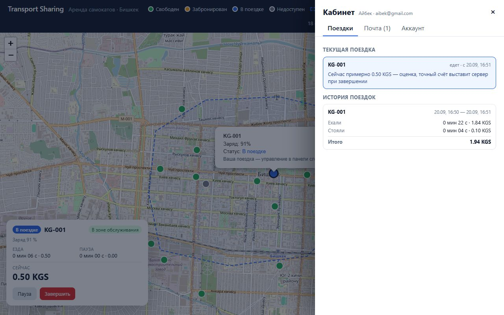
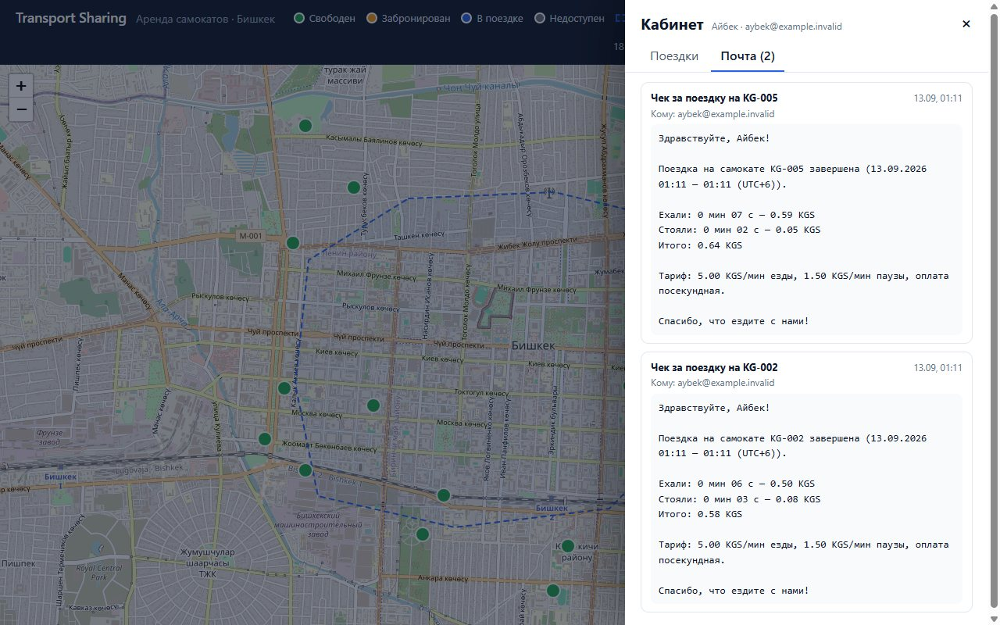
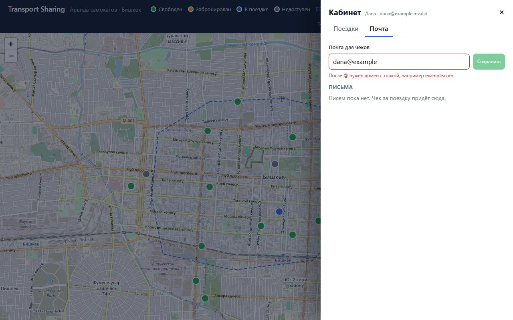
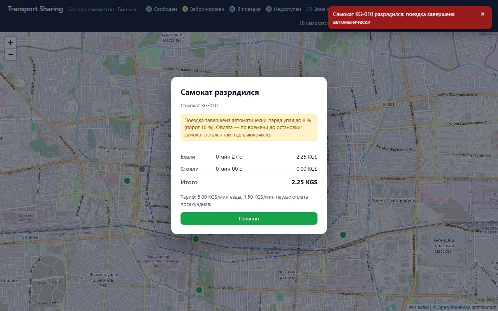
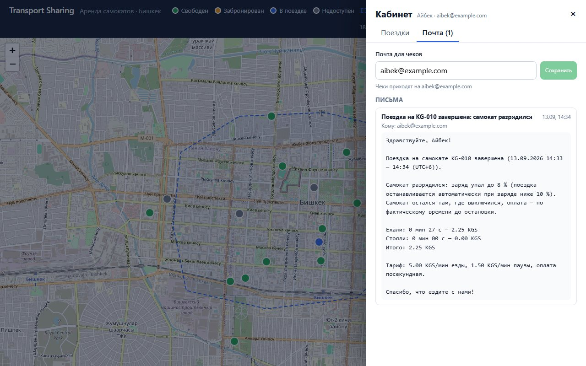
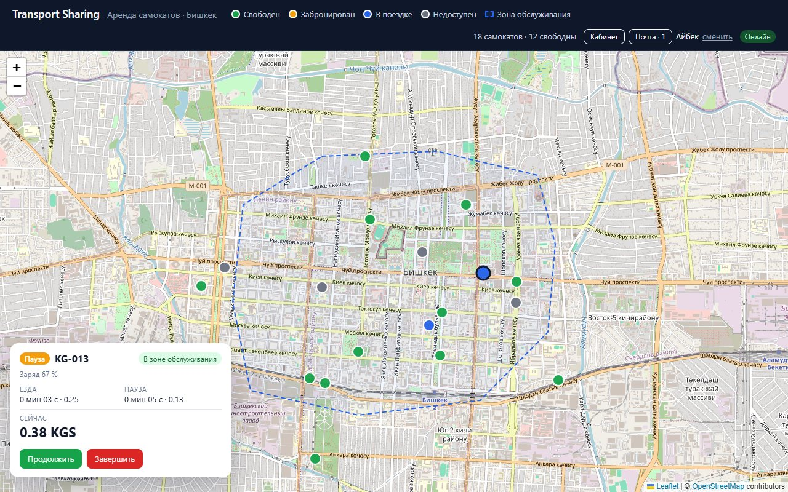

# Transport Sharing

Сервис шеринга самокатов — тестовое задание на вакансию Agentic Developer.

Клиент-серверное приложение: отдельный бэкенд (REST API + WebSocket), отдельный фронтенд (SPA
с картой), реляционная база и симулятор телеметрии. Пользователи бронируют самокаты на 15 минут,
бронь видна всем в реальном времени, снимается автоматически и защищена от гонок на уровне базы.
Из брони начинается поездка с посекундной тарификацией (езда и пауза по разным тарифам, деньги
только `Decimal`), завершить её можно только внутри зоны обслуживания; по завершении — чек с разбивкой
и письмо с тем же чеком на адрес, который пользователь указал в кабинете (почта — заглушка: письма
лежат в базе и видны в кабинете вместе с текущей поездкой и историей). Разрядившийся в поездке
самокат завершает её сам — со счётом, письмом-пояснением и статусом «недоступен». Состояние живёт на
сервере: закрытая вкладка не прерывает поездку. Всё поднимается одной командой через Docker Compose.

## Стек

| Слой | Технологии |
| --- | --- |
| Backend | Python 3.12, FastAPI, SQLAlchemy 2 (async, asyncpg), Alembic, pydantic-settings; uv, ruff, pytest |
| Frontend | React 19, Vite, TypeScript, react-leaflet + OpenStreetMap; oxlint, vitest |
| Simulator | Python 3.12, httpx; uv, ruff, pytest |
| База | PostgreSQL 16 |
| Инфраструктура | Docker Compose, nginx (раздача фронтенда и прокси `/api`, включая WebSocket), GitHub Actions |

## Быстрый старт (Docker)

Нужен Docker с Compose v2.

```bash
cp .env.example .env        # необязательно: у всех переменных есть значения по умолчанию
docker compose up --build
```

Поднимаются четыре сервиса: `db`, `backend` (применяет миграции и сидит 18 самокатов), `frontend`
и `simulator`, который двигает самокаты по Бишкеку и шлёт телеметрию. Через несколько секунд после
старта на карте появляются маркеры, и часть из них едет.

| Что | Адрес |
| --- | --- |
| Карта (фронтенд) | http://localhost:3000 |
| Список самокатов | http://localhost:3000/api/scooters (и http://localhost:8000/api/scooters напрямую) |
| WebSocket с обновлениями | `ws://localhost:3000/api/ws` |
| Health / readiness бэкенда | http://localhost:8000/api/health → `{"status":"ok"}`, http://localhost:8000/api/health/db |
| Swagger UI | http://localhost:8000/api/docs |
| PostgreSQL | `localhost:5432` (или `POSTGRES_PORT` из `.env`), пользователь/пароль/база — `scooter` |

Остановить: `docker compose down` (вместе с данными базы — `docker compose down -v`).

Если на хосте занят порт 3000, 8000 или 5432 (например, локальным PostgreSQL), первая же команда
упадёт с `port is already allocated`: задайте в `.env` другие `FRONTEND_PORT`, `BACKEND_PORT`,
`POSTGRES_PORT` и повторите — адреса ниже подставьте соответственно.

### Как это выглядит

| Карта с парком самокатов | Своя бронь: отсчёт в шапке и в попапе |
| --- | --- |
|  |  |

| Второй пользователь нажал «Забронировать» тот же самокат | Баннер и тост перед снятием брони |
| --- | --- |
|  |  |

| Поездка на паузе: панель с таймерами и текущей стоимостью | Завершить снаружи нельзя: бейдж, тост и подсказка |
| --- | --- |
|  |  |

| Чек после завершения внутри зоны | Кабинет: текущая поездка и история с разбивкой |
| --- | --- |
|  |  |

| Почта: по одному письму-чеку на поездку | Адрес для чеков: подсказка при неверном формате |
| --- | --- |
|  |  |

| Самокат разрядился: чек с пояснением и уведомление | Письмо о поездке, завершённой из-за разрядки |
| --- | --- |
|  |  |

| Вкладку закрыли посреди поездки и открыли снова: та же поездка, счёт шёл |
| --- |
|  |

Кадры брони сняты в сквозной проверке с укороченными интервалами (`BOOKING_TTL_SECONDS=60`,
`BOOKING_WARN_BEFORE_SECONDS=20`), поэтому на них минутный отсчёт; кадр разрядки — с ускоренным
расходом заряда (`SIM_USER_RIDE_DRAIN_PER_MINUTE=200`). Пунктирная граница на карте — зона
обслуживания.

### Что проверить на карте

- Маркеры окрашены по статусу (легенда в шапке): свободен, забронирован, в поездке, недоступен.
  В попапе — код, заряд и статус.
- Откройте две вкладки: обе получают одни и те же обновления по WebSocket, маркеры двигаются
  синхронно, без перезагрузки страницы. Индикатор в шапке показывает состояние соединения.
- Самокат с зарядом ниже `LOW_BATTERY_THRESHOLD` (15 %) становится недоступным и показывается серым.
  В сиде таких два (`KG-006`, `KG-012`); симулятор «заряжает» недоступные самокаты через
  `SIM_RECHARGE_SECONDS` (3 минуты), а у едущих заряд падает, так что серые маркеры появляются и
  позже. Правило можно вызвать вручную:

```bash
curl -X POST http://localhost:8000/api/telemetry -H "Content-Type: application/json" \
  -d '{"code": "KG-001", "lat": 42.8756, "lon": 74.6036, "battery": 5}'
```

### Бронирование

- При первом заходе интерфейс спрашивает имя — паролей нет. Вкладка помнит своего пользователя
  (`sessionStorage`), браузер — последних пользователей (`localStorage`): новая вкладка продолжает
  под последним, а второго пользователя даёт «сменить» в шапке — на экране имени есть кнопки
  «Продолжить как …» для уже известных и поле для нового. Так **две вкладки — два пользователя**
  без инкогнито, и закрытая вкладка не теряет поездку (см. «Пропала связь»).
- **Ограничение: входа нет.** «Продолжить как …» не спрашивает пароль, а сервер верит
  заголовку `X-User-Id`, поэтому любой, кто откроет сайт в том же браузере (или подставит чужой
  id в запрос), увидит чужую поездку, историю и почту и сможет действовать от чужого имени. Для
  тестового задания это осознанное упрощение — оно разрешает обойтись без входа; в продукте здесь
  нужны настоящий вход и сессионный токен (см. «Что дальше»).
- В попапе свободного самоката — «Забронировать на 15 мин». У своей брони в шапке и в попапе —
  обратный отсчёт и «Отменить»; у всех остальных самокат становится жёлтым.
- Нажмите «Забронировать» на одном и том же самокате в двух вкладках: бронь получит один, второй
  увидит «Самокат уже забронирован другим пользователем». Одновременно у пользователя только одна
  активная бронь.
- Без действий бронь снимается сама по истечении времени, за 3 минуты до этого приходит
  предупреждение (тост и баннер). Таймеры живут в базе: после `docker compose restart backend`
  активные брони и их сроки продолжают действовать.
- Чтобы не ждать 15 минут, задайте в `.env` короткие интервалы, например
  `BOOKING_TTL_SECONDS=60`, `BOOKING_WARN_BEFORE_SECONDS=20`, `BOOKING_SWEEP_INTERVAL_SECONDS=1`,
  и перезапустите `docker compose up -d backend`. Открытая вкладка на секунды перезапуска покажет
  «Переподключение…» и сама вернётся в «Онлайн»; бронь получит отсчёт с 01:00, предупреждение
  придёт за 20 секунд до снятия.

### Поездка

- У своей брони — «Начать поездку» (в шапке и в попапе). Самокат становится синим у всех и едет: в
  демо им управляет симулятор. Слева внизу — панель поездки: время и стоимость езды и паузы,
  текущая сумма, бейдж «В зоне / Вне зоны обслуживания», кнопки «Пауза» / «Продолжить» / «Завершить».
- Четыре самоката сида стоят снаружи зоны обслуживания — `KG-002` (Ошский базар), `KG-005`
  (вокзал), `KG-007` (Vefa), `KG-018` (Жибек Жолу / Эркиндик): у поездки с них бейдж «Вне зоны
  обслуживания» горит с первой секунды, а «Завершить» сразу даёт отказ — так удобно показать
  запрет. Для сценария «завершить внутри» берите самокат в центре, например `KG-001` (площадь
  Ала-Тоо) или `KG-013` (ЦУМ).
- «Пауза»: самокат останавливается, счёт продолжает расти по тарифу паузы (1.50 сом/мин против
  5.00 сом/мин езды). У других в попапе — «В поездке · пауза».
- Симулятор ведёт поездку пользователя попеременно к краю зоны катания (снаружи зоны обслуживания)
  и обратно в её центр: примерно через 2 минуты после старта самокат выезжает из зоны, остаётся
  снаружи около минуты, потом около 2.5 минут внутри. «Завершить» снаружи даёт тост «Вы вне зоны
  обслуживания — вернитесь в зону, чтобы завершить поездку», поездка продолжается.
- «Завершить» внутри — чек: сколько ехали, сколько стояли, сколько вышло; сумма строк равна
  итогу до копейки. Самокат снова свободен у всех.
- Не хочется ждать возвращения в зону: остановите симулятор (иначе через 3 секунды он вернёт
  самокат на своё место), отправьте от имени самоката телеметрию с координатами внутри зоны,
  нажмите «Завершить» и снова запустите симулятор:

```bash
docker compose stop simulator
curl -X POST http://localhost:8000/api/telemetry -H "Content-Type: application/json" \
  -d '{"code": "KG-001", "lat": 42.8756, "lon": 74.6036, "battery": 60}'
docker compose start simulator
```

### Кабинет и почта

- В шапке — «Кабинет» и «Почта». Кабинет открывается справа: вкладка «Поездки» показывает текущую
  поездку (самокат, состояние, с какого времени, оценка текущей суммы — подписана как оценка) и
  историю завершённых поездок, новые сверху: сколько ехали, сколько стояли, итог. Суммы — строки
  из чека сервера, клиент их не пересчитывает.
- «Завершить» внутри зоны — и на кнопке «Почта» появляется счётчик непрочитанных: письмо пришло
  по WebSocket без перезагрузки. Во вкладке «Почта» — письмо «Чек за поездку на KG-001» с адресом
  получателя и текстом чека: те же «Ехали / Стояли / Итого», что в чеке и в истории.
- Повторное завершение (`POST /api/rides/{id}/finish` ещё раз, обрыв и ретрай) второго письма не
  создаёт: за поездку — ровно одно.
- Панель закрывается крестиком, по `Esc` и кликом по карте; с клавиатуры фокус остаётся внутри
  панели. Если история или почта не загрузились (бэкенд перезапускался) — «Повторить».
- Почта — заглушка без SMTP: письма хранятся в базе и видны только своему пользователю
  (`GET /api/emails`). Адрес получателя — из поля «Почта для чеков» во вкладке «Почта»: формат
  проверяется на клиенте (без пробелов, ровно один `@`, домен с точкой, не длиннее 254):
  подсказка под полем появляется, как только вы уходите из поля или нажимаете «Сохранить»,
  дальше обновляется при вводе; и ещё раз сервером (422 `invalid_email` с той же подсказкой). Введите
  `aibek@example` — увидите «После @ нужен домен с точкой»; `aibek@example.com` — сохранится, и
  следующий чек уйдёт на него. Пока поле пустое, работает старый адрес из имени
  (`aybek@example.invalid`); существование адреса не проверяется — заглушка не умеет слать код.

### Разрядка в поездке

- Порог `RIDE_AUTO_FINISH_BATTERY` (по умолчанию 10 %): когда телеметрия приносит заряд *строго
  ниже* него у самоката в поездке, поездка завершается сама — счёт как обычно, до момента
  телеметрии, зона обслуживания не проверяется (человек не выбирал, где встать). Самокат
  становится **недоступным**, не свободным, и остаётся там, где выключился.
- **Почему порогов два и почему второй ниже.** `LOW_BATTERY_THRESHOLD` (15 %) — порог *выдачи*:
  ниже него самокат не бронируется и поездка не начинается, потому что заряда не хватит на
  разумную поездку. `RIDE_AUTO_FINISH_BATTERY` (10 %) — порог *прерывания* уже идущей поездки.
  Это разные решения с разной ценой ошибки: не выдать самокат с 14 % — мелкое неудобство, а
  остановить человека посреди дороги при тех же 14 % — грубо; зазор между порогами (15 → 10) —
  это резерв, на котором ездок доезжает до удобного места, а прерываем мы только когда самокат
  вот-вот встанет сам. Второй порог обязан быть не выше первого: при, скажем,
  `RIDE_AUTO_FINISH_BATTERY=20` поездка прервётся на 19 %, а 19 ≥ 15 — следующая же телеметрия
  вернула бы самокат в `available`, и следующий ездок начал бы поездку, которая завершилась бы
  на первом тике. Поэтому бэкенд отказывается стартовать с `RIDE_AUTO_FINISH_BATTERY >
  LOW_BATTERY_THRESHOLD`, а после автозавершения ставит `unavailable` явно, не полагаясь на порог
  выдачи.
- В интерфейсе: панель поездки показывает заряд и за 5 % до порога предупреждает; при
  завершении — тост «Самокат KG-010 разрядился: поездка завершена автоматически» и чек с
  пояснением (заряд и порог); в истории — пометка; в почте — письмо «Поездка на KG-010 завершена:
  самокат разрядился» с тем же пояснением.
- Увидеть за пару минут, а не за полчаса: в `.env` задайте ускоренный расход заряда у самоката в
  поездке пользователя и, если хочется, порог повыше (не выше `LOW_BATTERY_THRESHOLD`) — строки
  в `.env`:

```ini
SIM_USER_RIDE_DRAIN_PER_MINUTE=30
RIDE_AUTO_FINISH_BATTERY=10
```

  и перезапустите оба сервиса (compose читает `.env` при старте контейнеров):

```bash
docker compose up -d backend simulator
```

  Возьмите самокат с зарядом не меньше 80 % (в попапе): при 30 %/мин до порога 10 % — около
  2.5 минут (плюс ~2.7 %/мин от расстояния). Ориентир: минут ≈ (заряд − порог) / (расход + 2.7).
  Пауза заряд не тратит. После завершения самокат серый; через `SIM_RECHARGE_SECONDS` (3 мин)
  «техник» симулятора меняет батарею, и он снова зелёный.
- Без ожидания: остановите симулятор и отправьте телеметрию с низким зарядом от имени самоката
  из вашей поездки (координаты любые — зона не проверяется):

```bash
docker compose stop simulator
curl -X POST http://localhost:8000/api/telemetry -H "Content-Type: application/json" \
  -d '{"code": "KG-001", "lat": 42.85, "lon": 74.60, "battery": 5}'
docker compose start simulator
```

### Пропала связь

- Состояние поездки живёт на сервере, вкладка — только окно в него. Начните поездку, закройте
  вкладку, подождите, откройте сайт снова: вы под тем же именем, панель поездки показывает ту же
  поездку, таймер и сумма посчитаны от её начала на сервере (не от момента открытия). Чек при
  завершении покроет всё время, включая проведённое без вкладки. Если в этом браузере
  регистрировались несколько пользователей (сценарий с двумя вкладками), новая вкладка откроется
  под последним из них — нажмите «сменить» и «Продолжить как …» нужного: его поездка на месте.
- Если поездка закончилась, пока вкладки не было (самокат разрядился), при возврате один раз
  покажется чек с пояснением; письмо и запись в истории — как обычно.
- То же после обрыва WebSocket: после переподключения интерфейс перечитывает поездку, бронь,
  историю и почту с сервера.

## Состояние проекта

Шесть этапов закрыты, новых функций не планируется. Ниже — что есть на самом деле: что работает,
что сделано с упрощением и почему, чего не делали.

### Работает

- **Карта и реалтайм.** 18 самокатов из сида, маркеры по статусу, попап с кодом, зарядом и статусом;
  изменения приходят всем вкладкам по WebSocket, после обрыва клиент переподключается сам и
  перечитывает самокаты, бронь, поездку, историю и почту с сервера.
- **Телеметрия и заряд.** `POST /api/telemetry` обновляет самокат; заряд ниже 15 % делает его
  недоступным, заряд не ниже порога возвращает; пока самокат забронирован или в поездке, телеметрия
  статус не трогает.
- **Пользователи.** Регистрация по имени, вкладка помнит своего пользователя, браузер — последних,
  так что две вкладки — два пользователя без инкогнито.
- **Бронирование.** 15 минут, одна активная бронь на пользователя, отмена, автоснятие по
  `expires_at` фоновой задачей (переживает перезапуск бэкенда), предупреждение за 3 минуты ровно
  один раз. Гонка двух броней одного самоката решается блокировкой строк и частичным уникальным
  индексом — с конкурентным тестом на настоящем PostgreSQL.
- **Поездки.** Старт из своей брони, пауза, возобновление, завершение; все переходы идемпотентны;
  посекундная тарификация на `Decimal` из сегментов езды и паузы, чек сходится до копейки
  (`CHECK` в базе плюс общие с клиентом тестовые векторы); завершить можно только внутри зоны
  обслуживания, граница видна на карте.
- **Разрядка в поездке.** Заряд ниже порога завершает поездку сам: счёт, письмо с пояснением, тост и
  чек в интерфейсе, самокат недоступен, а не свободен; гонка с ручным завершением даёт одну
  завершённую поездку и одно письмо.
- **Кабинет и почта.** Текущая поездка, история с чеками, почтовый ящик с письмами-чеками (ровно одно
  на поездку), адрес для чеков с проверкой формата на клиенте и на сервере по одному набору правил.
- **Восстановление.** Состояние живёт на сервере: закрытая вкладка, обрыв WebSocket или перезапуск
  бэкенда не теряют ни поездку, ни бронь, ни их таймеры.
- **Симулятор.** Двигает парк и поездки пользователей (попеременно наружу зоны и обратно), разряжает
  едущие самокаты и «заряжает» недоступные, переживает недоступность бэкенда.
- **Сборка и проверка.** `docker compose up --build` поднимает четыре сервиса; overlay с hot
  reload; CI на каждый PR (ruff, pytest с PostgreSQL, oxlint, vitest, сборка). Тестов: 157 на
  бэкенде (1016 с параметризацией общих векторов), 40 в симуляторе, 70 на фронтенде.

### Ограничения и что не делали

Один список всего известного; для каждого пункта — почему так и что это значит.

1. **Вход без пароля.** Пользователь — это имя; сервер верит заголовку `X-User-Id` и сообщению
   `identify` в WebSocket, «Продолжить как …» ничего не спрашивает. Любой, кто подставит чужой id,
   действует от чужого имени. Задание разрешает обойтись без входа; силы ушли на конкурентность и
   тарификацию.
2. **Телеметрия без аутентификации.** `POST /api/telemetry` принимает данные от кого угодно —
   рецепты в этом README этим и пользуются (`curl` «от имени самоката»). На телеметрию опираются
   проверка зоны при завершении и автозавершение по разрядке; в продукте самокат подписывал бы её.
3. **Почта — заглушка.** SMTP нет: «отправить письмо» — вставить строку в таблицу `emails`, письмо
   видно только в кабинете. Существование адреса не проверяется: код подтверждения слать нечем.
   Задание это допускает.
4. **Оплаты нет.** Чек — это счёт, деньги не списываются: платёжного провайдера, баланса и долгов нет.
5. **Один процесс бэкенда, без Redis.** Хаб WebSocket живёт в памяти процесса. При двух воркерах
   или репликах данные не пострадают (фоновая задача броней использует `SKIP LOCKED` и атомарные
   `UPDATE`), но событие уйдёт только клиентам того процесса, который его породил.
6. **Движение по прямым.** Симулятор ведёт самокаты по отрезкам между случайными точками, сквозь
   кварталы; скорость (40 км/ч) и расход заряда завышены, чтобы движение и разрядку было видно.
7. **Интерфейс только для настольного браузера.** Адаптивной вёрстки под телефон нет, мобильного
   приложения нет; в шеринге основной сценарий — мобильный.
8. **Сквозные сценарии проверялись вручную.** В CI — юнит- и интеграционные тесты; сценарии в
   браузере (две вкладки, гонка брони, отказ вне зоны, разрядка, возврат во вкладку) прогонялись
   Playwright'ом на каждом этапе и записаны в DEVLOG, автоматических e2e-тестов нет.
9. **История и почта без страниц.** `GET /api/rides` и `GET /api/emails` отдают всё сразу; индекса
   `(user_id, finished_at)` нет. Для демо-парка достаточно, для тысяч поездок — нет.
10. **История броней не выведена.** Данные в базе есть, в кабинете показаны только поездки.
11. **Часы клиента.** Обратный отсчёт считается по часам браузера от серверного `expires_at`,
    расхождение часов не компенсируется; баннер (по часам клиента) и тост (по событию сервера) могут
    разойтись на период фоновой задачи.
12. **Точность таймеров — период фоновой задачи.** Снятие брони и предупреждение опаздывают не
    больше чем на `BOOKING_SWEEP_INTERVAL_SECONDS` (2 с) плюс запрос к базе; пока бэкенд не
    работает, ничего не снимается — первая итерация после старта доделывает пропущенное.
13. **Одна зона обслуживания из сида.** Многоугольник вокруг центра Бишкека сидится вместе с парком
    и редактируется только через базу или `backend/app/zones.py`; PostGIS нет, точка-в-полигоне —
    на чистом Python и TypeScript. Четыре самоката сида стоят снаружи зоны намеренно — чтобы
    показать отказ завершить.
14. **Тарифы без тарифных планов.** Тариф за минуту езды и паузы — из настроек, фиксируется в
    поездке при старте; стоимости разблокировки, минимальной суммы, скидок нет; валюта — подпись
    `KGS` из `GET /api/config`.
15. **Часовой пояс писем — один на сервис** (`LOCAL_TIMEZONE`), не на пользователя; API отдаёт UTC.
16. **Периметр не для публичного запуска.** Нет HTTPS, ограничения частоты запросов и защиты от
    CSRF (нет и cookie-сессий); учётные данные базы в `.env.example` — `scooter`/`scooter`. Для
    локального демо; перед публикацией нужны обратный прокси с TLS и настоящие секреты.
17. **Миграции применяются при старте контейнера** (`alembic upgrade head` перед uvicorn). Просто
    для демо; при нескольких репликах их выносят в отдельный шаг.
18. **Наблюдаемости нет.** Только логи uvicorn и симулятора: ни метрик, ни трассировки, ни алертов.
19. **Образы прибиты тегами, не дайджестами** (`python:3.12-slim-bookworm`, `node:22-alpine`,
    `nginx:1.28-alpine`, `postgres:16-alpine`). Зависимости Python и Node прибиты lock-файлами
    (`uv.lock`, `package-lock.json`; установка `uv sync --locked` и `npm ci` в Docker и CI).
20. **«Техник» только в симуляторе.** Недоступный самокат возвращается в строй, когда телеметрия
    принесёт заряд не ниже порога; в демо это делает симулятор через `SIM_RECHARGE_SECONDS`, в
    продукте — процесс обслуживания парка.

## Что дальше

Один список по убыванию важности; для каждого пункта — зачем он.

1. **Настоящий вход и сессионный токен.** Пока любой, кто знает или подберёт id, действует от
   чужого имени — без входа сервис нельзя выпускать к людям. Пароль или код на почту (поле уже
   есть), токен вместо `X-User-Id` и `identify`, «Продолжить как …» становится списком сохранённых
   сессий.
2. **Подпись телеметрии самокатом.** На неё опираются проверка зоны, автозавершение по разрядке и,
   значит, счёт; сейчас её может прислать кто угодно.
3. **Оплата.** Чек должен превращаться в списание: платёжный провайдер, привязанная карта, статус
   оплаты у поездки, запрет новой брони при долге.
4. **Настоящая отправка почты и подтверждение адреса.** Таблица `emails` уже очередь с
   дедупликацией: фоновый отправщик по SMTP или через провайдера, `sent_at`, повторы при сбое,
   фоновая проверка «завершённая поездка без письма»; с реальной доставкой — письмо с кодом и флаг
   «адрес подтверждён».
5. **Несколько воркеров.** Redis pub/sub вместо хаба в памяти, чтобы события доходили до клиентов
   любой реплики; фоновая задача броней к нескольким процессам уже готова.
6. **Сквозные тесты в CI.** Сценарии, которые сейчас прогоняются Playwright'ом вручную на каждом
   этапе (две вкладки, гонка брони, отказ вне зоны, разрядка, возврат во вкладку), — в
   автоматический прогон против compose-стека.
7. **Наблюдаемость.** Метрики (активные поездки, ошибки телеметрии, длительность запросов),
   структурированные логи, алерты — без них в продукте не понять, что происходит.
8. **Адаптивная вёрстка.** Карта и панели под телефон: основной сценарий шеринга — мобильный.
9. **Страницы и индексы.** `limit`/курсор для `GET /api/rides` и `GET /api/emails`, индекс
   `(user_id, finished_at)` — для тысяч поездок, а не демо-парка.
10. **Предупреждение о разрядке заранее.** Панель уже предупреждает за 5 % до порога; добавить
    письмо или уведомление «доедьте до зоны» и не выдавать самокат, которому заряда не хватит на
    разумную поездку.
11. **Компенсация расхождения часов.** Отдавать серверное время в `GET /api/config` и считать
    отсчёт по смещению, чтобы баннер и тост не расходились на машинах с неточными часами.
12. **История броней в кабинете.** Данные есть; вывести список с итогом каждой брони (использована,
    истекла, отменена).
13. **Управление зонами и парком.** Несколько зон, редактирование без правки сида, вывод самоката из
    оборота руками.
14. **Маршруты по улицам в симуляторе.** OSRM или граф дорог из OSM (osmnx) вместо прямых — ради
    реалистичной демонстрации; на сам сервис не влияет.

## API

| Метод и путь | Назначение |
| --- | --- |
| `GET /api/health` | liveness, без обращения к базе |
| `GET /api/health/db` | readiness: `SELECT 1`, при недоступной базе — 503 |
| `GET /api/scooters` | все самокаты: `code`, `lat`, `lon`, `battery`, `status`, `paused`, `updated_at` |
| `POST /api/telemetry` | `{code, lat, lon, battery}` от самоката; отвечает актуальным состоянием, 404 для неизвестного кода. Заряд ниже `RIDE_AUTO_FINISH_BATTERY` у самоката в поездке завершает её (см. «Разрядка в поездке») |
| `GET /api/config` | публичные настройки для интерфейса: длительность брони, порог предупреждения, порог заряда, тарифы и валюта |
| `POST /api/users` | регистрация по имени → `{id, name, created_at}`; дальше клиент шлёт `X-User-Id` |
| `GET /api/users/me` | проверка сохранённого id (401 — зарегистрироваться заново); в ответе `email` и `mail_address` — куда сейчас идут чеки |
| `PATCH /api/users/me` | `{email}` — адрес для чеков; `""`/`null` очищает; 422 `invalid_email` с ключом `problem` (`whitespace`, `at_sign`, `local_part`, `domain`, `too_long`) |
| `POST /api/bookings` | `{scooter_code}` → 201 бронь на `BOOKING_TTL_SECONDS`; 409 `scooter_not_available` / `user_has_active_booking` |
| `GET /api/bookings/active` | активная бронь пользователя или `null` |
| `POST /api/bookings/{id}/cancel` | отмена своей брони (403 чужая, 409 уже завершена) |
| `POST /api/rides` | `{booking_id}` → 201 поездка из своей активной брони (бронь → `used`, самокат → `riding`); повторный старт той же брони — 200 с той же поездкой; 403 чужая бронь, 409 `booking_not_active` / `user_has_active_ride` / `scooter_not_available` / `scooter_battery_low` |
| `GET /api/rides/active` | текущая поездка пользователя (активная или на паузе) или `null` |
| `GET /api/rides/{id}` | одна своя поездка (403 чужая, 404 нет): так вернувшаяся вкладка узнаёт, чем кончилась поездка, которую она помнила активной |
| `POST /api/rides/{id}/pause` | пауза (сегмент езды закрывается со стоимостью, открывается сегмент паузы); повтор — 200 без изменений |
| `POST /api/rides/{id}/resume` | возобновление; повтор — 200 без изменений |
| `POST /api/rides/{id}/finish` | завершение: 409 `outside_service_zone`, если самокат вне зоны; иначе 200 с `receipt`; повтор — 200 с тем же чеком; 409 `ride_finished` для паузы/возобновления завершённой. В поездке `finish_reason` (`user` / `battery`), для разрядки — `finish_battery` и `finish_battery_threshold` |
| `GET /api/rides` | история: завершённые поездки пользователя с чеками (`ride_seconds`, `ride_cost`, `pause_seconds`, `pause_cost`, `total_cost`), новые сверху |
| `GET /api/emails` | почтовый ящик пользователя: `[{id, to_address, subject, body, dedup_key, created_at}]`, новые сверху |
| `GET /api/zones` | зоны обслуживания: `[{id, name, points: [{lat, lon}, …]}]` |
| `WS /api/ws` | всем: `scooter.updated`; после `{"type": "identify", "user_id": N}` лично: `booking.created`, `booking.cancelled`, `booking.expiring` (с `seconds_left`), `booking.expired`, `ride.started`, `ride.paused`, `ride.resumed`, `ride.finished`, `email.sent` (с письмом) |

Правило заряда: если `battery` строго ниже порога, самокат получает статус `unavailable`; когда
телеметрия приносит заряд не ниже порога, недоступный самокат снова становится `available`.
Статусы `reserved` и `riding` телеметрия не меняет: пока самокат удерживает пользователь, заряд только
записывается — с одним исключением: заряд строго ниже `RIDE_AUTO_FINISH_BATTERY` у самоката в поездке
завершает поездку и делает самокат `unavailable` (раздел «Разрядка в поездке»). Правило порога
применяется в момент освобождения (отмена или снятие брони, завершение поездки: самокат становится
`unavailable`, если разрядился) и при старте поездки (с разряженного самоката поездку начать нельзя —
409 `scooter_battery_low`, бронь можно отменить).

Ошибки приходят как `{"detail": {"code": "...", "message": "..."}}`; интерфейс показывает текст по коду.

### Как устроена бронь

- Создание брони — одна транзакция: `SELECT … FOR UPDATE` строки пользователя, затем строки
  самоката. Второй одновременный запрос ждёт на блокировке, после коммита первого видит `reserved`
  и получает 409. Страховка — частичные уникальные индексы `bookings(scooter_id) WHERE status =
  'active'` и `bookings(user_id) WHERE status = 'active'`.
- Таймеры хранятся в базе (`expires_at`). Фоновая задача раз в `BOOKING_SWEEP_INTERVAL_SECONDS`
  снимает просроченные брони и возвращает самокаты, а за `BOOKING_WARN_BEFORE_SECONDS` до снятия
  отправляет пользователю уведомление ровно один раз (`warned_at` выставляется атомарным `UPDATE`).
  Перезапуск бэкенда ничего не теряет: первая итерация после старта доделывает пропущенное.
- Предупреждение приходит, когда до снятия осталось меньше `min(BOOKING_WARN_BEFORE_SECONDS,
  длина брони / 2)`: обычная 15-минутная бронь — за 3 минуты, короткая демо-бронь на 60 секунд —
  за 30 секунд, а не в момент создания.

### Точность таймеров

- Снятие и предупреждение делает фоновая задача с периодом `BOOKING_SWEEP_INTERVAL_SECONDS`
  (по умолчанию 2 с; задаётся в `.env`, пробрасывается в compose). Оба события опаздывают не
  больше чем на один период плюс время запроса к базе; при периоде 1 с бронь снимается через
  секунду после `expires_at`.
- Пока бэкенд не работает, ничего не снимается; после старта первая итерация снимает всё
  просроченное и досылает предупреждения, которые не успели уйти (`warned_at` пустой).
- Обратный отсчёт в интерфейсе считается по часам клиента от серверного `expires_at`;
  расхождение часов не компенсируется. Баннер появляется по клиентским часам, тост — по событию
  с сервера, поэтому они могут разойтись на период фоновой задачи.

### Как устроена поездка и тарификация

- Поездка (`rides`) состоит из сегментов (`ride_segments`) двух видов: езда и пауза. «Пауза»
  закрывает сегмент езды и открывает сегмент паузы, «Продолжить» — наоборот, «Завершить» закрывает
  открытый сегмент и выставляет чек. Тарифы фиксируются в поездке при старте: изменение настроек не
  меняет счёт уже идущей поездки.
- **Правило округления.** Оплата посекундная: `стоимость сегмента = тариф_в_минуту × секунды / 60`,
  округление до копейки половиной вверх — для каждого сегмента отдельно. Секунды сегмента — разность
  целых секунд, прошедших с начала поездки, поэтому дробные остатки переходят в следующий сегмент,
  а не теряются: сегменты в сумме дают `floor(длительность поездки)`, и частое переключение
  пауза/возобновление не обнуляет счёт. Стоимость езды — сумма сегментов езды, паузы — сумма
  сегментов паузы, итог — их
  сумма, поэтому разбивка всегда сходится с итогом (это закреплено и `CHECK` в базе, и тестами:
  границы минут, многократные паузы, свойство «копейки не теряются» на случайных наборах).
  Деньги — `Decimal` в коде, `NUMERIC(10,2)` в базе, строки вида `"7.50"` в JSON.
- Панель на клиенте считает текущую стоимость тем же правилом в целых копейках (закрытые сегменты —
  из стоимости, посчитанной сервером, открытый — по клиентским часам); источник истины при
  завершении — чек сервера. Одни и те же тестовые векторы лежат в pytest и vitest.
- Идемпотентность: повторный старт по той же брони, повторные пауза/возобновление и повторное
  завершение возвращают текущее состояние (200) и ничего не меняют; одновременные старты по одной
  брони создают одну поездку. Одна незавершённая поездка на пользователя и на самокат — частичные
  уникальные индексы плюс блокировки строк.
- **Зона обслуживания** хранится в таблице `service_zones` (многоугольник `{lat, lon}`), сидится вместе
  с самокатами и отдаётся через `GET /api/zones`. Завершить поездку можно только внутри хотя бы
  одной зоны; проверяется положение самоката по последней телеметрии, координаты в запросе не
  передаются. Точка-в-полигоне — лучевой алгоритм на чистом Python (и его копия на TypeScript для
  бейджа «в зоне / вне зоны»), без PostGIS: обоснование в DEVLOG. Пустой список зон означает
  «завершить нельзя», бэкенд пишет предупреждение в лог.
- **Точка ровно на границе — внутри.** Сначала проверяется попадание на ребро (вершина, середина
  ребра, любая точка на нём) с допуском `BOUNDARY_EPS = 1e-12` в градусах² — полоса около 10 мкм,
  и только потом применяется чётность пересечений. Ответ детерминирован: Python и TypeScript
  выполняют одни и те же операции над `double` в том же порядке и дают побитово одинаковый результат.
- **Паритет клиента и сервера — постоянный тест.** `shared/billing-cases.json` (генерируется
  `backend/scripts/generate_shared_cases.py`, сид фиксирован) содержит 417 стоимостей сегментов,
  150 поездок с чеками и 224 точки зоны, включая все вершины и середины рёбер; `pytest` пинит
  правило бэкенда к файлу, `vitest` сверяет с ним копии на TypeScript. Изменение правила округления
  или геометрии с любой стороны ломает тест, а не расходится молча. Так же устроен формат почты:
  `shared/email-cases.json` (написан руками, это спецификация) проверяется и `pytest`, и `vitest` —
  обе реализации должны вернуть один и тот же ключ проблемы для каждого случая.

### Почта-заглушка и письмо с чеком

- SMTP нет: «отправить письмо» значит записать строку в таблицу `emails` (получатель, тема, текст,
  `created_at`). Адрес — транслитерация имени пользователя (не длиннее 64 символов, RFC 5321) в
  домене `example.invalid`
  (зарезервирован RFC 2606, настоящей доставки быть не может). Письма отдаёт `GET /api/emails`,
  только свои; после завершения поездки владелец получает `email.sent` по WebSocket.
- **Одно письмо на ключ.** У каждого письма есть `dedup_key` с уникальным индексом, отправка —
  `INSERT … ON CONFLICT DO NOTHING`: два вызова с одним ключом (повтор, ретрай, две параллельные
  транзакции) дают одну строку, как и `warned_at` у брони. Сервис не коммитит: письмо пишется в
  той же транзакции, что и вызвавшее его изменение, и не появится без него.
- **Чек письмом.** При завершении поездки в её транзакции создаётся письмо с ключом
  `ride:{id}:receipt`: тема «Чек за поездку на KG-001», в тексте — «Ехали / Стояли / Итого» и тариф.
  Время поездки в письме — в зоне `LOCAL_TIMEZONE` (по умолчанию `Asia/Bishkek`) с пометкой
  `UTC+6`, как и на карточке письма в кабинете; в API время остаётся в UTC.
  Суммы берутся из колонок чека поездки, а не считаются заново, поэтому письмо, чек в ответе API,
  история и кабинет показывают одни и те же строки. Повторное завершение и параллельные завершения
  второго письма не создают — это закреплено тестами.
- **Разрядка: тот же порядок блокировок.** Телеметрия с зарядом ниже порога сначала ищет
  незавершённую поездку самоката (только id, без блокировки и без загрузки строки — иначе
  identity map отдала бы устаревшую копию), затем берёт `FOR UPDATE` на поездке и на самокате —
  как ручной `finish`. Гонка «телеметрия против ручного завершения» решается на строке поездки:
  второй видит `finished` и записывает телеметрию обычным путём. Письмо одно по ключу
  `ride:{id}:receipt`; статус `unavailable` ставится явно, а `RIDE_AUTO_FINISH_BATTERY` не может
  быть выше `LOW_BATTERY_THRESHOLD` (проверка при старте), иначе телеметрия вернула бы разряженный
  самокат в `available`.
- **Поездка первична, письмо вторично.** Вставка письма идёт в той же транзакции, но под
  savepoint: если она упадёт по любой причине, завершение всё равно коммитится (самокат свободен,
  чек выставлен), а ошибка уходит в лог. Повторный `POST /api/rides/{id}/finish` — он
  идемпотентный — дописывает недостающее письмо (ключ тот же, так что второго не будет) и только
  тогда шлёт `email.sent`. Обоснование — в DEVLOG.

## Режим разработки (hot reload)

Стек из «Быстрого старта» собирает фронтенд в статику, поэтому каждое изменение кода требует
пересборки образа. Для разработки есть overlay `docker-compose.dev.yml`:

```bash
docker compose -f docker-compose.yml -f docker-compose.dev.yml up --build
```

| Что | Как работает в dev-режиме |
| --- | --- |
| Фронтенд | Vite dev server на http://localhost:5173 с HMR; каталог `frontend/` примонтирован в контейнер, `/api` и WebSocket проксируются на бэкенд |
| Бэкенд | `uvicorn --reload` на http://localhost:8000; примонтированы `backend/app` и `backend/alembic` |
| База и симулятор | те же, что в обычном режиме |

После изменения зависимостей (`package.json`, `pyproject.toml`) пересоберите образы: запустите ту же
команду с `--build -V` (`-V` обновляет `node_modules` внутри контейнера фронтенда).

Порт dev-сервера фиксирован (5173): HMR-клиент Vite подключается к порту страницы. Работать без Docker
можно так же удобно — см. раздел «Локальная разработка без Docker».

## Локальная разработка без Docker

### Backend

Нужен [uv](https://docs.astral.sh/uv/) — он сам поставит Python 3.12 из `backend/.python-version`.
Для интеграционных тестов и запуска нужна база: `docker compose up -d db`.

```bash
cd backend
uv sync                                  # .venv + зависимости (включая dev)
uv run alembic upgrade head              # миграции
uv run python -m app.seed                # демо-парк (только в пустую таблицу)
uv run uvicorn app.main:app --reload     # http://localhost:8000/api/health
uv run pytest                            # все тесты, включая интеграционные с базой
uv run pytest -m "not db"                # только быстрые тесты без базы
uv run ruff check . && uv run ruff format --check .
```

Настройки читаются из переменных окружения либо из `.env` в корне репозитория и/или в `backend/`
(см. `app/core/config.py`). Интеграционные тесты сами создают базу `<POSTGRES_DB>_test`, прогоняют
в ней миграции и удаляют её после прогона; каждый тест выполняется в транзакции с откатом.
Тесты гонок (одновременные брони, ожидание на блокировке строки) используют фикстуру
`committed_db` с настоящими коммитами и очисткой таблиц после теста.

Если порт 5432 на хосте занят (например, локально установленным PostgreSQL), задайте в `.env`
другой `POSTGRES_PORT` (скажем, `15432`): compose опубликует базу на нём, а бэкенд и тесты подхватят
значение из того же `.env`.

### Frontend

Нужен Node.js 22+.

```bash
cd frontend
npm install
npm run dev      # http://localhost:5173, /api и WebSocket проксируются на localhost:8000
npm run lint     # oxlint
npm test         # vitest
npm run build    # tsc + vite build → dist/
```

Адрес бэкенда для dev-прокси можно переопределить переменной `VITE_API_PROXY_TARGET`.

### Simulator

```bash
cd simulator
uv sync
uv run pytest
uv run ruff check . && uv run ruff format --check .
BACKEND_URL=http://localhost:8000 uv run python -m scootersim
```

## Симулятор

Отдельный сервис `simulator` (пакет `scootersim`): берёт список самокатов у бэкенда, часть из них
отправляет в поездки к случайным точкам центра Бишкека, у едущих падает заряд, и раз в
`SIM_INTERVAL_SECONDS` шлёт телеметрию по HTTP. Самокат, который бэкенд пометил недоступным,
«заряжает техник» через `SIM_RECHARGE_SECONDS`. Недоступность бэкенда симулятор переживает: пишет
предупреждение, ждёт с экспоненциальной паузой (до 30 с) и пробует снова, процесс не завершается.

Самокаты со статусом `riding` (поездки пользователей) симулятор тоже двигает: попеременно к внешнему
краю зоны катания (она чуть больше зоны обслуживания, поэтому самокат оказывается снаружи) и обратно
в её центр, всегда кратчайшим путём. Поездка на паузе стоит. Забронированные самокаты стоят на месте.
У самоката в поездке пользователя заряд падает и от времени (`SIM_USER_RIDE_DRAIN_PER_MINUTE`), а не
только от расстояния — так автозавершение по разрядке можно показать за пару минут.

Все переменные ниже читаются из окружения; compose пробрасывает каждую из них в контейнер
симулятора, так что значение в `.env` действует и в Docker (после `docker compose up -d simulator`).

| Переменная | По умолчанию | Назначение |
| --- | --- | --- |
| `BACKEND_URL` | `http://localhost:8000` (в compose — `http://backend:8000`) | адрес API |
| `SIM_ACTIVE_SCOOTERS` | `6` | сколько самокатов едут одновременно |
| `SIM_INTERVAL_SECONDS` | `1.5` | период тика и отправки телеметрии |
| `SIM_SPEED_KMH` | `40` | скорость (завышена, чтобы движение было заметно) |
| `SIM_DRAIN_PER_KM` | `4` | расход заряда в процентах на километр (завышен для демо) |
| `SIM_RECHARGE_SECONDS` | `180` | через сколько «техник» заряжает недоступный самокат |
| `SIM_MIN_RIDE_BATTERY` | `20` | ниже этого заряда самокат не начинает поездку |
| `SIM_HEARTBEAT_TICKS` | `20` | как часто стоящие самокаты шлют телеметрию |
| `SIM_HELD_HEARTBEAT_TICKS` | `2` | как часто шлют телеметрию забронированные и стоящие на паузе (чтобы быстро узнать о старте и возобновлении) |
| `SIM_REFRESH_TICKS` | `2` | как часто перечитываются статусы самокатов с бэкенда (3 с: бронь и старт видны почти сразу) |
| `SIM_USER_RIDE_DRAIN_PER_MINUTE` | `0.5` | дополнительный расход заряда у самоката в поездке пользователя, % в минуту езды (пауза не тратит); 30 — чтобы увидеть автозавершение за пару минут |

## Миграции

```bash
cd backend
uv run alembic revision --autogenerate -m "describe change"
uv run alembic upgrade head
```

Alembic берёт URL базы из тех же переменных `POSTGRES_*`, что и приложение. Все модели должны
импортироваться в `app/models/__init__.py`, чтобы autogenerate их видел.

## Переменные окружения

Полный список с комментариями — в [`.env.example`](.env.example).

| Переменная | По умолчанию | Назначение |
| --- | --- | --- |
| `POSTGRES_USER` / `POSTGRES_PASSWORD` / `POSTGRES_DB` | `scooter` | учётные данные и имя базы |
| `POSTGRES_HOST` | `localhost` | хост базы для запуска без Docker (в compose всегда `db`) |
| `POSTGRES_PORT` | `5432` | порт базы на хосте (в compose-сети всегда `5432`) |
| `BACKEND_PORT` | `8000` | порт бэкенда на хосте |
| `FRONTEND_PORT` | `3000` | порт фронтенда на хосте |
| `DEBUG` | `false` | SQL-логи SQLAlchemy |
| `LOW_BATTERY_THRESHOLD` | `15` | порог заряда, ниже которого самокат недоступен |
| `RIDE_AUTO_FINISH_BATTERY` | `10` | заряд строго ниже — поездка завершается сама; не выше `LOW_BATTERY_THRESHOLD` |
| `BOOKING_TTL_SECONDS` | `900` | длительность брони |
| `BOOKING_WARN_BEFORE_SECONDS` | `180` | за сколько до снятия предупредить пользователя |
| `BOOKING_SWEEP_INTERVAL_SECONDS` | `2` | период фоновой проверки `expires_at` |
| `RIDE_RATE_PER_MINUTE` / `PAUSE_RATE_PER_MINUTE` | `5.00` / `1.50` | тарифы, сом за минуту езды и паузы (оплата посекундная) |
| `LOCAL_TIMEZONE` | `Asia/Bishkek` | зона для времени в письмах (API отдаёт время в UTC) |
| `SIM_ACTIVE_SCOOTERS` / `SIM_INTERVAL_SECONDS` | `6` / `1.5` | параметры симулятора (остальные — в разделе «Симулятор») |
| `SIM_USER_RIDE_DRAIN_PER_MINUTE` | `0.5` | расход заряда у самоката в поездке пользователя, % в минуту; для демо разрядки — 30 |

## Структура репозитория

```
.
├── backend/                  FastAPI-приложение
│   ├── app/
│   │   ├── api/              роутеры: health, config, scooters, users, bookings, rides, emails, zones, ws
│   │   ├── core/             настройки (pydantic-settings)
│   │   ├── db/               Base, async engine, сессии
│   │   ├── models/           ORM-модели (Scooter, User, Booking, Ride, RideSegment, ServiceZone, Email)
│   │   ├── realtime/         хаб WebSocket-соединений, события, publish (что роутеры объявляют после коммита)
│   │   ├── schemas/          Pydantic-схемы
│   │   ├── services/         телеметрия, брони, поездки (старт/пауза/завершение/история, автозавершение
│   │   │                     по разрядке), почта-заглушка и формат адреса, письмо с чеком, sweeper
│   │   ├── billing.py        тарификация на Decimal: сегменты, округление, чек
│   │   ├── geo.py            точка в полигоне без PostGIS
│   │   ├── zones.py          встроенная зона обслуживания (сид)
│   │   └── seed.py           демо-парк самокатов
│   ├── alembic/              миграции (async env)
│   ├── tests/                pytest: юнит + интеграционные с PostgreSQL
│   ├── Dockerfile
│   └── pyproject.toml        зависимости, ruff, pytest
├── frontend/                 React + Vite
│   ├── src/
│   │   ├── api/              типы, HTTP-клиент с X-User-Id, users/bookings/rides/account/config
│   │   ├── account/          почтовый ящик (dedupe, непрочитанные), история поездок, формат e-mail, хуки
│   │   ├── booking/          состояние брони, хук useBooking
│   │   ├── ride/             тарификация в копейках, точка в полигоне, состояние поездки, память о поездке, хуки
│   │   ├── components/       CityMap, ScooterMarkers, ZoneLayer, MyBooking, RidePanel, ReceiptModal, AccountPanel, EmailField, …
│   │   ├── config/           константы карты и статусов
│   │   ├── hooks/            useNow, useToasts
│   │   ├── realtime/         стор самокатов и хук WebSocket (identify, события брони, поездки, почты)
│   │   └── user/             личность вкладки и браузера (session/localStorage), хук useCurrentUser
│   ├── Dockerfile            стадии deps / dev / build → nginx
│   └── nginx.conf            статика + прокси /api и /api/ws → backend
├── simulator/                симулятор телеметрии (пакет scootersim)
│   ├── scootersim/           config, geo, fleet, client, runner
│   ├── tests/
│   └── Dockerfile
├── shared/                   контракты клиент/сервер: billing-cases.json, email-cases.json
├── .github/workflows/ci.yml  GitHub Actions
├── docker-compose.yml        postgres, backend, frontend, simulator
├── docker-compose.dev.yml    overlay для разработки: hot reload фронта и бэка
├── .env.example
├── DEVLOG.md                 журнал решений и допущений
└── PROMPTS.md                промпты владельца проекта
```

## CI

GitHub Actions запускается на push в `main` и на pull request'ах:

- **backend** — сервис `postgres:16`, `uv sync --locked`, `ruff check`, `ruff format --check`, `pytest`
  (включая интеграционные тесты с базой);
- **simulator** — `uv sync --locked`, `ruff check`, `ruff format --check`, `pytest`;
- **frontend** — `npm ci`, `npm run lint`, `npm test`, `npm run build`.

## Как делался проект

- **Агент и модели.** Код, тесты, миграции и документация написаны агентом Claude Code (Anthropic)
  в настольном приложении; владелец проекта выбирал стек, ставил задачи по этапам, принимал
  решения, ревьюил и мержил PR. Этапы 1–3 (каркас; самокаты, телеметрия и реалтайм; бронирование)
  сделаны моделью Fable 5, этапы 4–7 (поездки и тарификация; почта и кабинет; разрядка,
  восстановление и почта пользователя; финальная полировка) — Opus 5.
- **Процесс.** Каждый этап начинается с промпта владельца — он сохранён как есть в
  [`PROMPTS.md`](PROMPTS.md); затем запись дизайна и допущений в [`DEVLOG.md`](DEVLOG.md),
  реализация в ветке `feature/dayN-…` небольшими коммитами (тесты и линт перед каждым) и pull
  request через `gh pr create` с описанием «что сделано / как проверить / чеклист». Владелец
  оставлял замечания в PR, агент отвечал отчётом о правках (строка «Ответ агента (Claude Code,
  Opus 5):») в той же ветке; мержил только владелец. В `main` — только смерженные PR, по одному на
  этап: [список pull request'ов](https://github.com/Someone1print/Mad-Devs-Transport-Sharing/pulls?q=is%3Apr).
- **Ревью до кода и после.** С этапа 4 дизайн и реализацию перед PR прогоняла панель независимых
  агентов-ревьюеров (линзы: деньги, конкурентность, продукт, простота; каждая находка — через
  трёх скептиков, которые пытались опровергнуть её по коду); подтверждённые находки исправлялись до
  PR. Что нашли и что изменилось — в DEVLOG по каждому этапу.
- **Проверка.** На каждом этапе — сквозной прогон в Docker через Playwright: две вкладки и два
  пользователя, гонки, укороченные интервалы; результаты и скриншоты — в DEVLOG и в этом README.
  Перед сдачей README пройден с нуля из чистого клона.
- **Журналы.** Решения с датой, временем (Asia/Bishkek, UTC+6, записывается в момент решения) и
  обоснованием — в [`DEVLOG.md`](DEVLOG.md); все промпты владельца, включая короткие уточнения, — в
  [`PROMPTS.md`](PROMPTS.md).
